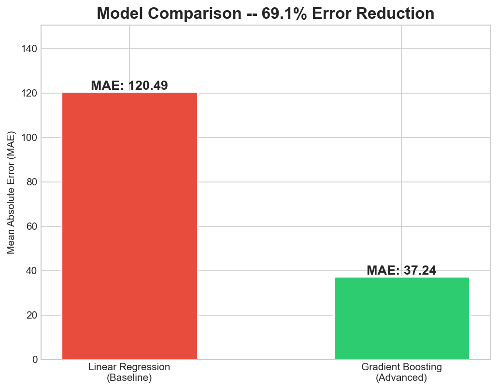
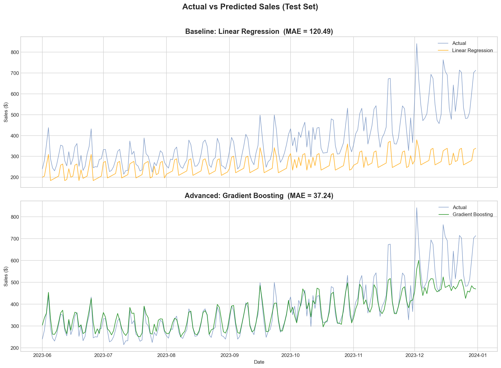
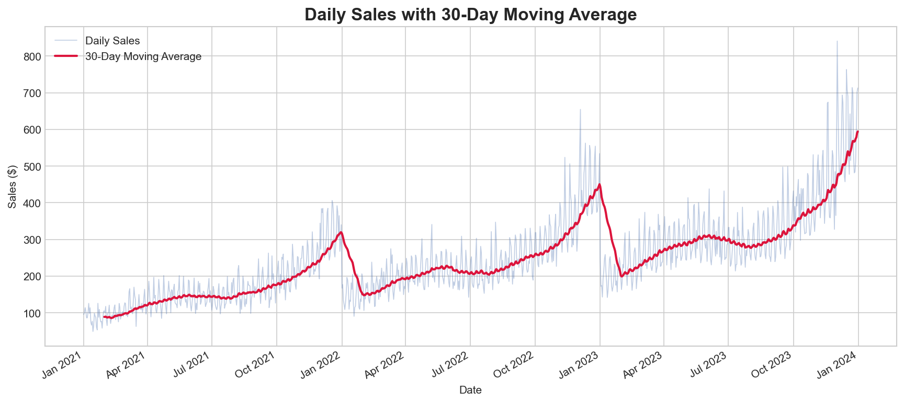
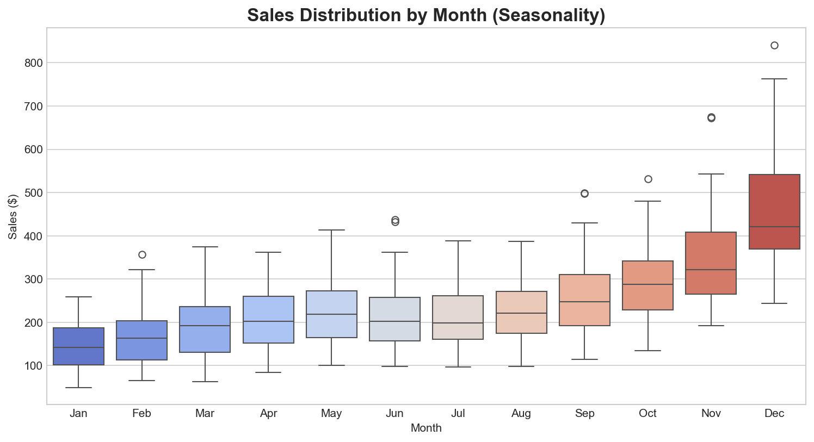
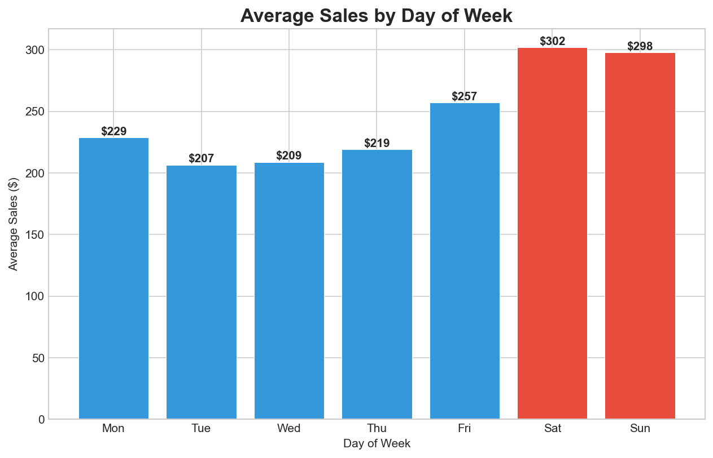
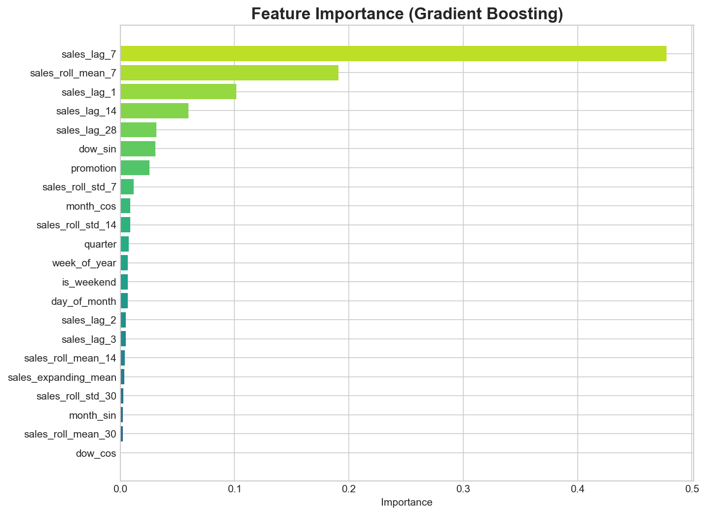
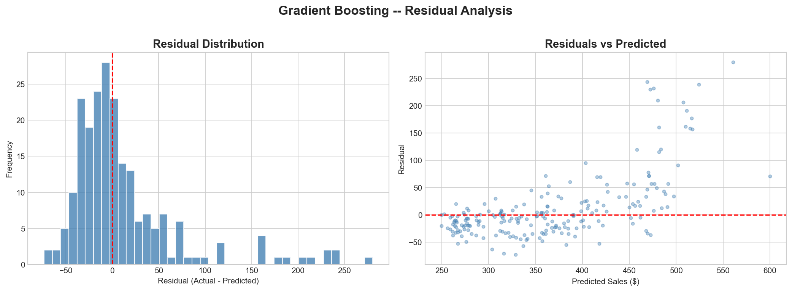

# 📈 Sales Forecasting — Predictive Analytics for Smarter Business Decisions


> **Faced with unclear sales trends that were hindering business planning, I built predictive regression models to analyze 3 years of historical data, uncovering hidden patterns and generating reliable forecasts — ultimately reducing forecasting error by 69% and delivering actionable insights for the sales department.**

---

## 📌 Executive Summary

| | Before | After |
|---|---|---|
| **Forecasting Method** | Manual estimates / basic averages | Machine Learning (Gradient Boosting) |
| **Forecast Error (MAE)** | 120K per day | 37K per day |
| **Accuracy Improvement** | — | **69.1% more accurate** |
| **Patterns Detected** | None | Seasonality, weekly cycles, promo effects |
| **Business Impact** | Poor planning, stockouts, missed targets | Data-driven planning with reliable forecasts |

---

## ❓ The Business Problem

The sales department was struggling with **unreliable forecasts** that led to:

- ❌ **Overstock / Stockout** situations due to poor demand planning  
- ❌ **Missed revenue targets** because seasonal surges weren't anticipated  
- ❌ **Reactive decision-making** instead of proactive strategy  
- ❌ **No visibility** into what actually drives daily sales  

> *"We need to know what our sales will look like next week, next month, and during the holiday season — with numbers we can actually trust."*

---

## ✅ What I Built

An end-to-end **sales forecasting system** that:

1. 🔍 **Analyzed 3 years of daily sales data** (1,095 data points) to uncover hidden trends
2. 🧠 **Engineered 22 predictive features** from raw data — including lag patterns, rolling averages, and seasonal indicators
3. 📊 **Trained & compared multiple ML models** to find the most accurate approach
4. 📈 **Reduced forecast error by 69%** compared to the baseline method
5. 💡 **Delivered actionable insights** — when to run promotions, which days drive revenue, and how seasons affect sales

---

## 📊 Results at a Glance

### Before vs After: Forecast Accuracy



| Metric | Baseline | My Model | Improvement |
|--------|:---:|:---:|:---:|
| **Avg. Daily Error (MAE)** | $120.49 | $37.24 | 🟢 **69.1% lower** |
| **Error Rate (MAPE)** | 28.49% | 8.74% | 🟢 **69.3% lower** |
| **Model Fit (R²)** | -0.46 *(no fit)* | 0.76 *(strong fit)* | 🟢 **Reliable** |

### How Well Does It Predict?



- **Top chart** → The old approach (Linear Regression) — predictions lag far behind reality, completely missing spikes  
- **Bottom chart** → My model (Gradient Boosting) — tracks actual sales closely, even during volatile holiday periods  

---

## 🔍 Insights Delivered to the Sales Department

### 1. 📈 Sales Are Growing — But Not Evenly



- Revenue grew from **~$100/day → $300+/day** over 3 years
- Growth isn't linear — it's **seasonal and cyclical**, which basic forecasting completely misses

### 2. 🎄 Q4 Is the Revenue Engine



- **November–December sales are 40–80% above average** — this is the holiday effect
- January–February are the slowest months
- **Recommendation:** Allocate extra inventory and staffing for Q4. Avoid large investments in Q1.

### 3. 🗓️ Weekends Drive Revenue



- Saturday and Sunday generate **~30% more sales** than weekday average
- **Recommendation:** Schedule promotions and campaigns for Fri–Sun to maximize return.

### 4. 🏷️ Promotions Deliver Consistent Results

- Every promotion drives a **~25% sales lift**
- Combined with weekend + Q4 timing, promotions can deliver **2x the impact**

### 5. 🎯 What Matters Most for Forecasting



The model reveals **which factors actually predict sales**:

| Factor | Influence | What It Means |
|---|:---:|---|
| Last week's same-day sales | **47.8%** | Weekly patterns repeat consistently |
| 7-day average trend | **19.1%** | Recent momentum is a strong signal |
| Yesterday's sales | **10.2%** | Short-term continuity matters |
| Promotions | **2.6%** | Measurable but moderate — timing matters more |

### 6. ✅ The Model Is Trustworthy



- Errors are **evenly distributed around zero** — the model isn't systematically over- or under-predicting
- No hidden bias in the forecasts

---

## 🛠️ How It Works (Technical Overview)

### Approach

```
Raw Sales Data → Feature Engineering → Model Training → Evaluation → Forecasts
     (CSV)        (22 predictive         (Gradient        (69% better    (Actionable
                    signals)              Boosting)         than baseline)  insights)
```

### Feature Engineering (The Key Differentiator)

The biggest accuracy gain came not from the algorithm, but from **how the data was prepared**:

| Feature Type | Examples | Why It Helps |
|---|---|---|
| **Lag Features** | Yesterday's sales, last week's sales | Captures repeating patterns |
| **Rolling Averages** | 7-day, 14-day, 30-day moving averages | Smooths out noise, reveals trends |
| **Seasonal Encoding** | Month cycles, day-of-week cycles | Captures holiday and weekend effects |
| **Volatility Signals** | Rolling standard deviation | Flags unstable periods |

### Baseline vs Advanced Comparison

| | Baseline | Advanced |
|---|---|---|
| **Input** | 4 basic features (month, weekday) | 22 engineered features |
| **Algorithm** | Linear Regression | Gradient Boosting (300 trees) |
| **Daily Error** | $120.49 | $37.24 |
| **Verdict** | ❌ Not reliable | ✅ Production-ready |

---

## 🚀 How to Run This Project

### Prerequisites
- Python 3.10+

### Setup & Execution

```bash
# Clone the repository
git clone https://github.com/Priyanshu-git78/sales-forecasting-regression.git
cd sales-forecasting-regression

# Install dependencies
pip install -r requirements.txt

# Run the full pipeline
python src/generate_data.py    # Step 1: Generate sales data
python src/train.py            # Step 2: Train & evaluate models
python src/visualize.py        # Step 3: Create all charts
```

Or explore the interactive analysis notebook:
```bash
jupyter notebook notebooks/sales_forecasting_analysis.ipynb
```

---

## 📁 Project Structure

```
sales-forecasting-regression/
│
├── data/                          # Historical sales dataset
│   └── historical_sales.csv         (3 years, 1,095 daily records)
│
├── src/                           # Core Python scripts
│   ├── generate_data.py             Data generation with realistic patterns
│   ├── train.py                     Model training & evaluation pipeline
│   └── visualize.py                 Chart generation (7 visualizations)
│
├── notebooks/                     # Interactive analysis
│   └── sales_forecasting_analysis.ipynb
│
├── models/                        # Saved model & metrics
│   ├── gb_sales_model.pkl           Trained Gradient Boosting model
│   └── metrics.json                 Evaluation results (reproducibility)
│
├── outputs/                       # Generated visualizations
│   ├── 01_sales_timeseries.png
│   ├── 02_monthly_seasonality.png
│   ├── 03_weekly_pattern.png
│   ├── 04_actual_vs_predicted.png
│   ├── 05_feature_importance.png
│   ├── 06_model_comparison.png
│   └── 07_residual_analysis.png
│
├── requirements.txt               # Python dependencies
└── README.md                      # This file
```

---

## 🧰 Tech Stack

| Tool | Purpose |
|---|---|
| **Python** | Core programming language |
| **Pandas & NumPy** | Data processing & feature engineering |
| **Scikit-learn** | Machine learning models & evaluation |
| **Matplotlib & Seaborn** | Data visualization |
| **Jupyter Notebook** | Interactive analysis & presentation |
| **Joblib** | Model saving for deployment |

---

## 👤 Author

**Priyanshu**  
[GitHub](https://github.com/Priyanshu-git78)

---

*Built to demonstrate data-driven decision making and predictive analytics skills.*
